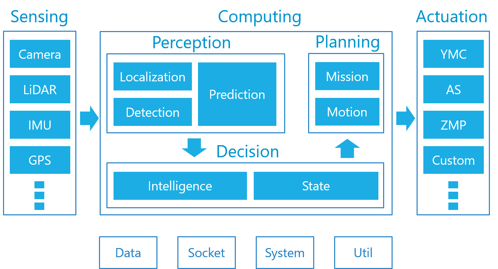

[](https://www.autoware.ai)

This is a fork of Autoware v1.10.0 for evaluation of rosbag data taken from a test vehicle.

# Autoware

[Autoware](https://www.autoware.ai) is the world's first "all-in-one" open-source software for self-driving vehicles. The capabilities of Autoware are primarily well-suited for urban cities, but highways, freeways, mesomountaineous regions, and geofenced areas can be also covered. The code base of Autoware is protected by the BSD License. Please use it at your own discretion. For safe use, we provide a ROSBAG-based simulation environment for those who do not own real autonomous vehicles. If you plan to use Autoware with real autonomous vehicles, **please formulate safety measures and assessment of risk before field testing.**

You may refer to [Autoware Wiki](https://github.com/CPFL/Autoware/wiki) for **Users Guide** and **Developers Guide**.

## What Is Autoware

[](https://github.com/CPFL/Autoware/wiki/Overview)

Autoware provides a rich set of self-driving modules composed of sensing, computing, and actuation capabilities. An overview of those capabilities is described [here](https://github.com/CPFL/Autoware/wiki/Overview). Keywords include *Localization, Mapping, Object Detection & Tracking, Traffic Light Recognition, Mission & Motion Planning, Trajectory Generation, Lane Detection & Selection, Vehicle Control, Sensor Fusion, Cameras, LiDARs, RADARs, Deep Learning, Rule-based System, Connected Navigation, Logging, Virtual Reality, and so on*.

Free manuals can be also found at [Autoware-Manuals](https://github.com/CPFL/Autoware-Manuals). You are encouraged to contribute to the maintenance of these manuals. Thank you for your cooperation!

## Getting Started

[](https://github.com/CPFL/Autoware/wiki/Demo)

### Recommended System Specifications

- Number of CPU cores: 8
- RAM size: 32GB
- Storage size: 64GB+

## Requirements

- ROS indigo (Ubuntu 14.04) or ROS jade (Ubuntu 15.04) or ROS kinetic (Ubuntu 16.04)
- OpenCV 2.4.10 or higher
- Qt 5.2.1 or higher
- CUDA(Optional)
- FlyCapture2 (Optional)
- Armadillo (Optional)

**Please use checkout revision before 2015/OCT/21 if you use Autoware on ROS hydro or Ubuntu 13.04, 13.10.**

### Install dependencies for Ubuntu 14.04 indigo

```
% sudo apt-get install ros-indigo-desktop-full ros-indigo-nmea-msgs ros-indigo-nmea-navsat-driver ros-indigo-sound-play ros-indigo-jsk-visualization ros-indigo-grid-map ros-indigo-gps-common
% sudo apt-get install ros-indigo-controller-manager ros-indigo-ros-control ros-indigo-ros-controllers ros-indigo-gazebo-ros-control ros-indigo-sicktoolbox ros-indigo-sicktoolbox-wrapper ros-indigo-joystick-drivers ros-indigo-novatel-span-driver
% sudo apt-get install libnlopt-dev freeglut3-dev qtbase5-dev libqt5opengl5-dev libssh2-1-dev libarmadillo-dev libpcap-dev gksu libgl1-mesa-dev libglew-dev software-properties-common libyaml-cpp-dev python-flask python-requests
% sudo add-apt-repository ppa:mosquitto-dev/mosquitto-ppa
% sudo apt-get install libmosquitto-dev
```

**NOTE: Please do not install ros-indigo-velodyne-pointcloud package. Please uninstall it if you already installed.**

### Install dependencies for Ubuntu 16.04 kinetic
```
% sudo apt-get install ros-kinetic-desktop-full ros-kinetic-nmea-msgs ros-kinetic-nmea-navsat-driver ros-kinetic-sound-play ros-kinetic-jsk-visualization ros-kinetic-grid-map ros-kinetic-gps-common
% sudo apt-get install ros-kinetic-controller-manager ros-kinetic-ros-control ros-kinetic-ros-controllers ros-kinetic-gazebo-ros-control ros-kinetic-joystick-drivers
% sudo apt-get install libnlopt-dev freeglut3-dev qtbase5-dev libqt5opengl5-dev libssh2-1-dev libarmadillo-dev libpcap-dev gksu libgl1-mesa-dev libglew-dev python-wxgtk3.0 software-properties-common libmosquitto-dev libyaml-cpp-dev python-flask python-requests
```

**NOTE: Following packages are not supported in ROS Kinetic.**
- gazebo
- orb slam
- dpm ocv

## How to Build

```
$ cd ~/Autoware/ros/src
$ catkin_init_workspace
$ cd ../
$ ./catkin_make_release
```
###Caffe based object detectors
CV based detectors RCNN and SSD nodes are not automatically built.

### Users Guide

1. [Installation](https://github.com/CPFL/Autoware/wiki/Installation)
    1. [Docker](https://github.com/CPFL/Autoware/wiki/Docker)
    1. [Source](https://github.com/CPFL/Autoware/wiki/Source-Build)
1. [Demo](https://github.com/CPFL/Autoware/wiki/Demo)
1. [Field Test](https://github.com/CPFL/Autoware/wiki/Field-Test)
1. [Simulation Test](https://github.com/CPFL/Autoware/wiki/Simulation-Test)
1. [Videos](https://github.com/CPFL/Autoware/wiki/videos)

### Developers Guide

1. [Contribution Rules](https://github.com/CPFL/Autoware/wiki/Contribution-Rules) (**Must Read**)
1. [Overview](https://github.com/CPFL/Autoware/wiki/Overview)
1. [Specification](https://github.com/CPFL/Autoware/wiki/Specification)

## For Developers

Be careful when changing files under `ros/src/sensing/drivers/lidar/packages/velodyne`. There is **subtree**.
The original repository is [here](https://github.com/CPFL/velodyne). If you change those files from this
repository, you must use **git subtree push**. (Please never change and push code if you don't understand
`git subtree` well).

GitFlow, the git branching model, is used in the Autoware repository.
- When you adding new features, you can branch off your feature branch from `develop`.
  you can use the following command.
  `$ git checkout -b feature/[your_branch_name] develop`
- When you find bugs in `master`, you can branch off your hotfix branch from `master`.
  you can use the following command.
  `$ git checkout -b hotfix/[your_branch_name] master`

See [docs/en/branching_model.md](docs/en/branching_model.md)

More details [here](http://nvie.com/posts/a-successful-git-branching-model/)

## Main Packages

### Localization
- ndt_localizer
- icp_localizer

### Detection
- lidar_tracker
- cv_tracker
- road_wizard

### Mission (Global) Planning
- lane_planner
- way_planner
- freespace_planner

### Motion (Local) Planning
- astar_planner
- lattice_planner
- dp_planner

### Vehicle Control
- waypoint_follower
- waypoint_maker

## Research Papers for Citation

1. S. Kato, S. Tokunaga, Y. Maruyama, S. Maeda, M. Hirabayashi, Y. Kitsukawa, A. Monrroy, T. Ando, Y. Fujii, and T. Azumi,``Autoware on Board: Enabling Autonomous Vehicles with Embedded Systems,'' In Proceedings of the 9th ACM/IEEE International Conference on Cyber-Physical Systems (ICCPS2018),  pp. 287-296, 2018. [Link](https://dl.acm.org/citation.cfm?id=3207930)

2. S. Kato, E. Takeuchi, Y. Ishiguro, Y. Ninomiya, K. Takeda, and T. Hamada. ``An Open Approach to Autonomous Vehicles,'' IEEE Micro, Vol. 35, No. 6, pp. 60-69, 2015. [Link](https://ieeexplore.ieee.org/document/7368032/)

## Cloud Services

### Autoware Online

You may test Autoware at [Autoware Online](http://autoware.online/). No need to install the Autoware repository to your local environment.

### Automan

You may annotate and train your ROSBAG data using your web browser through [Automan](https://www.automan.ai). The trained models can be used for deep neural network algorithms in Autoware, such as SSD and Yolo.

### ROSBAG STORE

You may download a number of test and simulation data sets from Tier IV's [ROSBAG STORE](https://rosbag.tier4.jp). Note that free accounts would not allow you to access image data due to privacy matters. 

### Map Tools

You may create 3D map data through Tier IV's [Map Tools](https://maptools.tier4.jp/). The 3D map data used in Autoware are composed of point cloud structure data and vector feature data.

## License

Autoware is provided under the [Apache 2 License](https://github.com/CPFL/Autoware/blob/master/LICENSE).

## Contact

Autoware Developers Slack Team (https://autoware.herokuapp.com/)

Autoware Developers (<autoware@googlegroups.com>)

To subscribe to the Autoware Developers mailing list,
- If you have a Google account, go to https://groups.google.com/d/forum/autoware, and click the **Apply to Join Group** button.
- If you don't have a Google account, send an email to autoware+subscribe@googlegroups.com.

***
<div align="center"></div>
